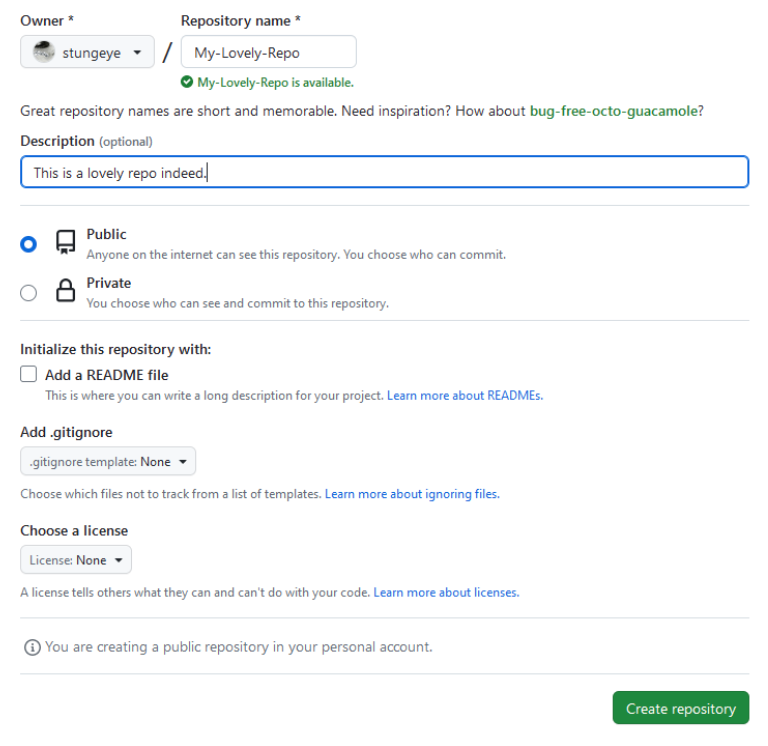

<!-- prettier-ignore-start -->

# Adding / Configuring a GitHub Remote 
{: .no_toc }

GitHub is one of many Git version control remote repository services that you can use.

Using a GitHub remote allows for you to make changes to your repository from any machine as long as it is all linked to the same repository.

## Table of Contents
{: .no_toc }

1. TOC
{:toc}

<!-- prettier-ignore-end -->

## Introduction to GitHub

There are numerous ways of setting up a remote repository using Git and one of the options is **GitHub**.

GitHub is a hosting platform for Git repositories owned by Microsoft. It provides a web-based interface to interact with your repositories and adds social and collaboration features.

## Remote Repository / GitHub Terminology

**Push**: Send commits made on a local repository to the remote repository. Send changes to the remote repository.

**Pull**: Fetch and merge changes from a repository into the current branch. Used to keep local repositories up to date with remote repository.

**Clone**: Make a full copy of a repository at its current state. Commonly used in collaborative projects to make a local copy of a remote repository.

## Adding a Repository To GitHub

To save a local git repository to your GitHub account, you must first create a new repository by way of the "+" button in the top right corner of the GitHub website.

_**IMPORTANT:** Be sure not to initialize with a README or with any other files._



## Linking Your Local Repository to GitHub

To link a local repository to GitHub, you take your repository name, for this example its `My-Lovely-Repo`. Make sure it is an initialized Git repository.

From the command line (within the project folder) add GitHub as a remote:

```
git remote add origin https://github.com/<INSERT-YOUR-GITHUB-USERNAME>/My-Lovely-Repo.git
```

_Reminder that `<INSERT-YOUR-GITHUB-USERNAME>` should be replaced with your GitHub username._

Check if the remote has been added to a repository:
```
git remote -v
```

## Sources and Additional Resources:

- [Image Source](https://stungeye.github.io/Software-Development-And-Documentation-1/02-git-version-control-next-steps/index.html#47)

- [Class Notes](https://stungeye.github.io/Software-Development-And-Documentation-1/02-git-version-control-next-steps/index.html#45)

- [Set up Git](https://docs.github.com/en/get-started/git-basics/set-up-git)
